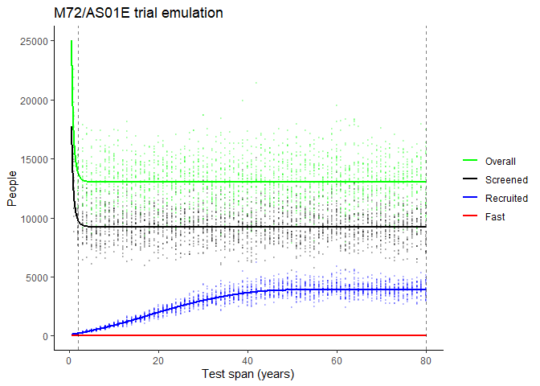
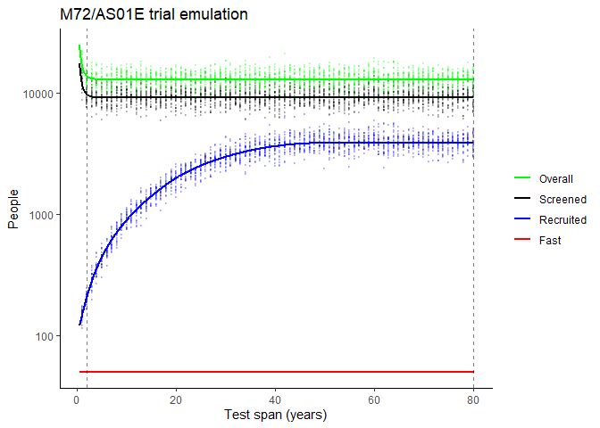
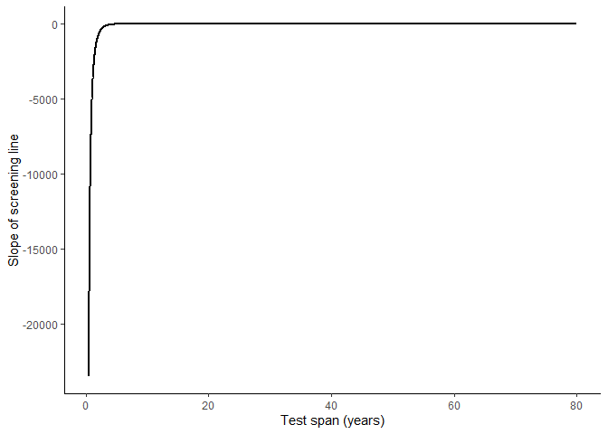
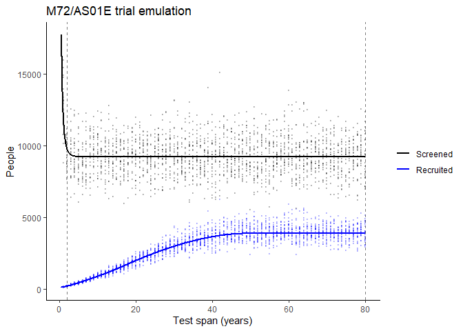
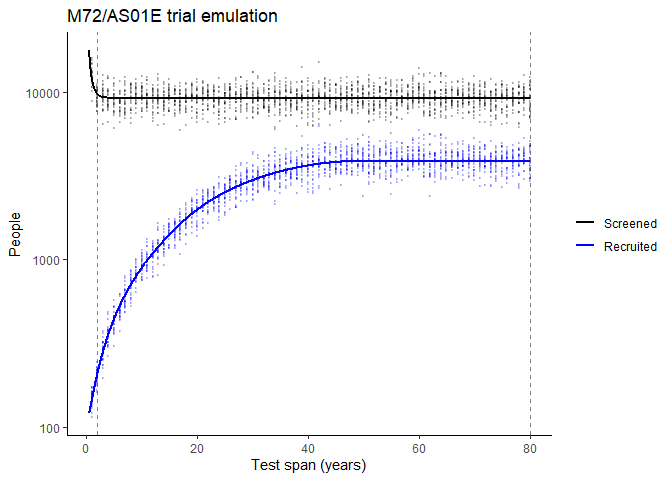
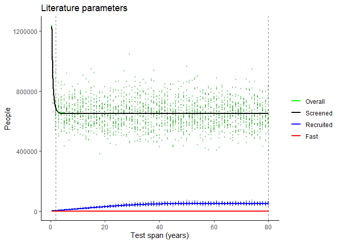
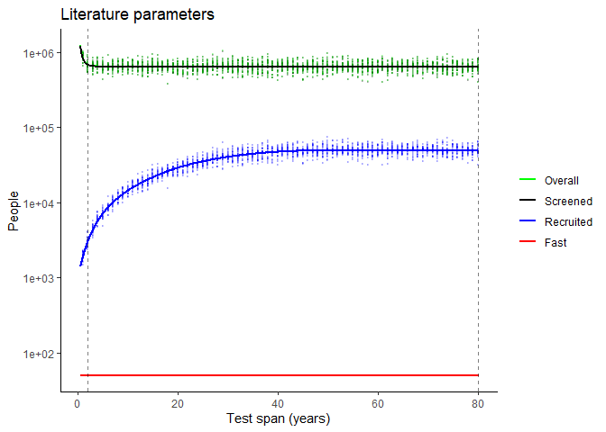
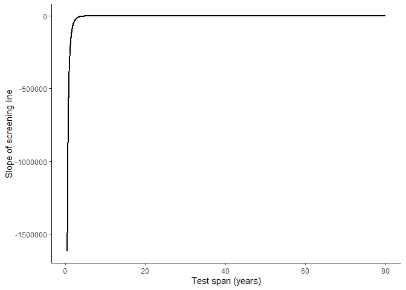

# MINA_TB README


This code base `MINA_TB` aims to estimate the required size of
Tuberculosis vaccine trials under different assumptions. Note: this
README file renders to README.md.

## Conventions

### Folders

Code and data are stored in the respective `code/` / `data/` folders.
Model outputs are saved in `outputs/`, usually as .csv files, and
figures in `figures/`. See `notes/` folder for details on how the model
code has developed over time.

### Code

`code/trialsim_rote.R` was Stephen’s main code for running the analysis.
This has been copied to `run_analysis.qmd` in the parent folder for ease
of editing (02/19/2026), with new clearer naming conventions.

All helper functions are stored in `code/utils.R`. If a piece of code is
re-used more than twice, it should ideally be written up as a function
and added to `utils.R`. Naming conventions for functions are as follows:

`sim_` = run the code

`plot_` = make a plot

`_analytic` = analytical approach, using probability expressions derived
in `documentation/MINA-TB.pdf` (formerly called ‘theory’)

`_stoch` = stochastic simulation-based approach, also described in
`documentation/MINA-TB.pdf` (formerly called ‘trials’)

The probability expressions derived in `documentation/MINA-TB.pdf` are
also saved as the following functions:
`p_inf_and_type_and_asymp_given_age`, `p_asymp_given_age`, and
`p_inf_and_type_given_asymp_and_age`.

Lastly, naming of parameter sets uses the following conventions:

`_lit` = parameter values are taken from the literature

`_m72IIb` = parameter values are backcalculated from the M72 phase 2b
trial (Van Der Meeren et al., 2018) (formerly called ‘nejm’)

## Example workflow

The file `code/trialsim_rote.R` has been preserved as an example
workflow. Key steps are as follows:

1.  import functions

``` r
library(tidyverse)
```

    Warning: package 'forcats' was built under R version 4.5.1

    ── Attaching core tidyverse packages ──────────────────────── tidyverse 2.0.0 ──
    ✔ dplyr     1.1.4     ✔ readr     2.1.5
    ✔ forcats   1.0.0     ✔ stringr   1.5.1
    ✔ ggplot2   3.5.2     ✔ tibble    3.3.0
    ✔ lubridate 1.9.4     ✔ tidyr     1.3.1
    ✔ purrr     1.0.4     
    ── Conflicts ────────────────────────────────────────── tidyverse_conflicts() ──
    ✖ dplyr::filter() masks stats::filter()
    ✖ dplyr::lag()    masks stats::lag()
    ℹ Use the conflicted package (<http://conflicted.r-lib.org/>) to force all conflicts to become errors

``` r
library(readxl)
source('code/utils.R')
```

2.  define parameter values

``` r
pars_m72IIb_igra <- list(
    minage=18,
    maxage=49,
    rho=rep(0.0275,80),
    p_slow=0.5,
    mu_slow=0.0001,
    mu_fast=1.5,
    sigma=100,
    ve=0.55,
    trial_length=3)
pars_m72IIb_tasa <- pars_m72IIb_igra
pars_m72IIb_tasa$sigma <- 2

pars_lit_igra <- list(
    minage=18,
    maxage=49,
    rho=rep(0.0025,80),
    p_slow=0.95,
    mu_slow=0.0001,
    mu_fast=1.5,
    sigma=100,
    ve=0.55,
    trial_length=3)
pars_lit_tasa <- pars_lit_igra 
pars_lit_tasa$sigma <- 2
```

3.  define an age distribution e.g. uniform

``` r
agedist <- rep(1, 80)
names(agedist) <- 1:80
agedist <- agedist/sum(agedist)
```

4.  simulate trials under m72IIb conditions (analytical and stochastic
    approaches)

``` r
#' Simulate the stochastic approach with m72IIb params, over the duration of positivity sigma OR pre-load saved csv file
# stochastic_df_m72IIb <- sim_stoch_over_sigma(pars=pars_m72IIb_igra, sigmavec=1:80, reps=25)
stochastic_df_m72IIb <- read_csv("output/stochastic_df_m72IIb_uniform.csv")
```

    Rows: 2000 Columns: 7
    ── Column specification ────────────────────────────────────────────────────────
    Delimiter: ","
    dbl (7): sigma, rep, n_tested, n_recruited, n_fast, n_slow, n_overall

    ℹ Use `spec()` to retrieve the full column specification for this data.
    ℹ Specify the column types or set `show_col_types = FALSE` to quiet this message.

``` r
#' Simulate the analytical approach with m72IIb params, over the duration of positivity sigma
analytical_df_m72IIb <- sim_analytic_over_sigma(pars=pars_m72IIb_igra, sigmavec=seq(from=.5, to=80, by=0.01), agedist=agedist)
analytical_df_m72IIb %>% filter(sigma %in% c(0.5, 1, 1.5, 2, 5))
```

    # A tibble: 5 × 6
      sigma n_tested n_recruited n_fast n_slow n_overall
      <dbl>    <dbl>       <dbl>  <dbl>  <dbl>     <dbl>
    1   0.5   17720.        121.     50   71.1    25003.
    2   1     11982.        147.     50   96.9    16906.
    3   1.5   10373.        177.     50  127.     14636.
    4   2      9747.        210.     50  160.     13752.
    5   5      9240.        445.     50  395.     13037.

``` r
#' Plot all results
fig_stochastic_analytic_m72IIb <- plot_stochastic_analytic(stochastic_df_m72IIb, analytical_df_m72IIb, 
                                           cols=c("n_tested","n_recruited","n_fast","n_overall")) + 
    labs(title="M72/AS01E trial emulation")
fig_stochastic_analytic_m72IIb
```



``` r
ggsave(fig_stochastic_analytic_m72IIb, file="figures/stochastic_analytic_m72IIb.pdf", width=5, height=5/1.6)

fig_stochastic_analytic_log_m72IIb <- fig_stochastic_analytic_m72IIb + scale_y_continuous(trans="log10")
fig_stochastic_analytic_log_m72IIb
```



``` r
ggsave(fig_stochastic_analytic_log_m72IIb, file="figures/stochastic_analytic_log_m72IIb.pdf", width=5, height=5/1.6)

fig_screenslope_m72IIb <- plot_screenslope(analytical_df_m72IIb)
fig_screenslope_m72IIb
```



``` r
fig_stochastic_analytic_m72IIb_r21 <- plot_stochastic_analytic(stochastic_df_m72IIb, analytical_df_m72IIb, cols=c("n_tested","n_recruited")) + 
    labs(title="M72/AS01E trial emulation")
fig_stochastic_analytic_m72IIb_r21
```



``` r
ggsave(fig_stochastic_analytic_m72IIb_r21, file="figures/stochastic_analytic_m72IIb_r21.pdf", width=5, height=5/1.6)

fig_stochastic_analytic_m72IIb_r21_log <- plot_stochastic_analytic(stochastic_df_m72IIb, analytical_df_m72IIb, 
                                                   cols=c("n_tested","n_recruited")) + 
    labs(title="M72/AS01E trial emulation") + 
    scale_y_continuous(trans="log10")
fig_stochastic_analytic_m72IIb_r21_log
```



``` r
ggsave(fig_stochastic_analytic_m72IIb_r21_log, file="figures/stochastic_analytic_m72IIb_r21_log.pdf", width=5, height=5/1.6)
```

5.  simulate trials under literature conditions (analytical and
    stochastic approaches)

``` r
#' Simulate the stochastic approach with lit params, over the duration of positivity sigma OR pre-load saved csv file
# stochastic_df_lit <- sim_stoch_over_sigma(pars=pars_lit_igra, sigmavec=1:80, reps=25)
stochastic_df_lit <- read_csv("output/stochastic_df_lit_uniform.csv")
```

    Rows: 2000 Columns: 7
    ── Column specification ────────────────────────────────────────────────────────
    Delimiter: ","
    dbl (7): sigma, rep, n_tested, n_recruited, n_fast, n_slow, n_overall

    ℹ Use `spec()` to retrieve the full column specification for this data.
    ℹ Specify the column types or set `show_col_types = FALSE` to quiet this message.

``` r
#' Simulate the analytical approach with lit params, over the duration of positivity sigma
analytical_df_lit <- sim_analytic_over_sigma(pars=pars_lit_igra, sigmavec=seq(from=.5, to=80, by=0.01), agedist=agedist)
analytical_df_lit %>% filter(sigma %in% c(0.5, 1, 1.5, 2, 5))
```

    # A tibble: 5 × 6
      sigma n_tested n_recruited n_fast n_slow n_overall
      <dbl>    <dbl>       <dbl>  <dbl>  <dbl>     <dbl>
    1   0.5 1230461.       1400.     50  1350.  1235485.
    2   1    835368.       1885.     50  1835.   838779.
    3   1.5  725231.       2441.     50  2391.   728193.
    4   2    682664.       3052.     50  3002.   685451.
    5   5    648869.       7210.     50  7160.   651518.

``` r
#' Plot all results
fig_stochastic_analytic_lit <- plot_stochastic_analytic(stochastic_df_lit, analytical_df_lit, cols=c("n_tested","n_recruited","n_fast","n_overall")) + 
    labs(title="Literature parameters")
fig_stochastic_analytic_lit
```



``` r
ggsave(fig_stochastic_analytic_lit, file="figures/stochastic_analytic_lit.pdf", width=5, height=5/1.6)

fig_stochastic_analytic_log_lit <- fig_stochastic_analytic_lit + scale_y_continuous(trans="log10")
fig_stochastic_analytic_log_lit
```



``` r
ggsave(fig_stochastic_analytic_log_lit, file="figures/stochastic_analytic_log_lit.pdf", width=5, height=5/1.6)

fig_screenslope_lit <- plot_screenslope(analytical_df_lit)
fig_screenslope_lit
```



Possible extensions to the above basic workflow are to include custom
age distribution in `sim_stoch` and custom fast targets for
`sim_stoch_over_sigma` and `sim_analytic_over_sigma`.
