# 6 June 2025

Personal recap of the meeting this week with Kristin and Tyler:

- **Aim 1:** How might a test for recency of TB infection (e.g., TASA) improve our ability to do the things listed below, beyond what's possible with existing diagnostics (e.g., IGRA)?
  - Assessing risk of infection
  - Measuring incidence/prevalence (more accurately, with less lag)
  - Vaccine trials (measuring community-level transmission)
  - Compare to Styblo approach
  - Can we specify the sensitivity, specificity, and timing of a recency test to be maximally useful for these applications?
- **Aim 2:** How might a test for TB infectiousness (CASS, facemasks) improve our ability to control TB?
  - There's confounding between supershedders and super-contacters. How can we account for this? In which contact contexts might an indicator of biological infectiousness be helpful?
  - Tools like CASS have been sidelined because they're not "effective" enough... but could this be a feature, not a bug? if they can only detect people with extremely high infectiousness, could this be exactly what we want?
  - What kind of sensitivity and specificity -- in terms of predicting the number of secondary cases -- would we want from an infectiousness test? Can we specify the test parameters we'd want for it to be a useful outbreak control tool?

I'd like to code up some initial sims. I want to see if I've got the right ideas in mind, and we might be able to use some of the output for preliminary data.

Some code architecture:

- Simulate an epidemic curve
- Simulate sampling at various points in time, with different tests
- Show estimates of incidence and prevalence over time

Before diving in, I want to look at existing TB models. Some useful resources:

- [Guidance for country-level TB modelling](https://researchonline.lshtm.ac.uk/id/eprint/4653000/1/gomez_etal_2019_guidance_for_country-level_tb_modelling.pdf) (led by Nick Menzies)
- [Progression from latent infection to active disease in dynamic tuberculosis transmission models: a systematic review of the validity of modelling assumptions](https://www.thelancet.com/journals/laninf/article/PIIS1473-3099(18)30134-8/abstract) (Menzies ... Cohen)
- [Prospects for Tuberculosis Elimination in the United States: Results of a Transmission Dynamic Model](https://academic.oup.com/aje/article-abstract/187/9/2011/4995883) (Menzies, Cohen ... Salomon)
- [Comparative Modeling of Tuberculosis Epidemiology and Policy Outcomes in California](https://www.atsjournals.org/doi/full/10.1164/rccm.201907-1289OC) (Menzies ... Shete)
- [The Impact of Realistic Age Structure in Simple Models of Tuberculosis Transmission](https://journals.plos.org/plosone/article?id=10.1371/journal.pone.0008479) (Brooks-Pollock, Cohen, Murray)
- [Interferon-Gamma Release Assays versus Tuberculin Skin Testing for the Diagnosis of Latent Tuberculosis Infection: An Overview of the Evidence](https://onlinelibrary.wiley.com/doi/10.1155/2013/601737) (Trajman, Steffen, Menzies)

# 16 July 2025

Aim 3 -- if you could collect some bare minimum info on contacts, would that be enough to disentangle timing of infectiousness(?)

Some questions:

- We now have two aims pages -- just tests for recent infection, or both tests for recency and tests for infectiousness?
  - if we do scope it down to two aims: are those substantive enough to sustain two full aims?
  - probably yes -- let's maybe just keep it with the two aims.
- A potential [collaborator](https://wikitia.com/wiki/Claudia_Denkinger)

Scheduling -- deadline Oct 12 (Sun), internal deadline Oct 6-7. Sep 29 for admin documents.

9-ish weeks between now and then;

Aim for push over next 5 weeks; most of writing in August.

Significance & Innovation (2 weeks) Approach (2 weeks)

Check for draft from Kristin in early Aug...

Aim 2 feels like the more challenging of the two?

Plot two incidence curves -- ideally with similar IGRA profiles but yielding different TASA curves, just to show that there's information there.

(maybe something too to deminstrate the value of starting TBT for people with a recent infection vs. an IGRA-positive infection)

one more application in the context of vax trials? --\> gating entry into vaccine trial based on people who are IGRA positive. Could gating by TASA be better? (1) is transmission intense enough and (2) at an individual level, could we use TASA to be more predictive for good eligibility?

(still structure aims as vaccine trials + epidemic dynamics)

Look out for rough schedule to get us to submission. Review, give comments.

# 27 July 2025

Some goals for preliminary data modelling:

- Simulate a clinical trial, or do some sample size calculations for a trial, under different rates of progression to TB. Consider using a test to (a) determine eligibility for a trial and (b) refine sample size estimates by getting better notion of incidence in a community.

Let's start there. A second aim would be similar to what I was working on above: how might a test for recency of infection reveal changes in incidence/prevalence that would be obscured with an IGRA-style test?

Let's try to come up with something simple for the first case:

For now, imagine TB incidence is at a steady state. Can we simulate how long ago a person was infected, given that we're at this steady state? And then we can simulate timing of infection, test positivity, etc.

Imagine $\rho$ is the incidence of TB (e.g. new cases per 100,000 people) in a given country. There's also going to be some rate of progressing to active TB after infection, and this I think is non-constant: you have a high risk close to your time of infection, then after that, the risk goes down. I should try to find some curves in the literature on this.

If I did have it in hand, what would I do? Maybe (a) simulate infection times, (b) simulate whether a person goes on to active disease (maybe that's the way to do it), (c) simulate the time the person goes on to active disease, for those who do; where I'd reduce the probability of progressing to active disease for those who are vaccinated.

(If I'm remembering correctly, I think that a main use case for vaccines is to prevent the progression to active disease; that's why we'd be recruiting people who are IGRA positive but aren't currently showing symptoms.)

Kristin notes the interesting fact that, using a test for recency of infection, it'd maybe take longer to recruit but less time to reach the endpoints. That said, since we'd need a smaller sample size, maybe we wouldn't actually need longer to recruit?

I'm going to work with Structure F from here: <https://pubmed.ncbi.nlm.nih.gov/29653698/>

Some useful information in the first paragraph of that paper:

> Latent infection is a defining feature of tuberculosis epidemiology. On infection with Mycobacterium tuberculosis, approximately 5% of otherwise healthy adults will develop active disease within 2 years (so-called fast progressors).1,2 Individuals who do not have rapid progression are classified as having slow-progressing latent tuberculosis infection. With latent infection, individuals experience no adverse health effects and will not transmit M tuberculosis, but they face an ongoing risk of developing active tuberculosis through reactivation. For individuals with long-established infection, the annual risk of active tuberculosis is low; empirical estimates are on the order of 10–20 per 100 000 individuals.3 However, as a result of high prevalence of latent tuberculosis infection in many settings,4reactivation can represent a substantial proportion of incident tuberculosis cases, or even the majority of such cases in settings in which transmission has been in sustained decline.5 The risk of progressing to active disease also varies by individual characteristics, with infants,6 individuals with advanced HIV infection,7,8 and individuals with other conditions that affect immune function9–12 having elevated progression risks.

So: aim for 5% of people as fast progressors who develop disease on average after 1 year. I might model this using an exponential distribution with rate 1.5 / year, which gives us 77% of people progressing after 1 year and 95% of people progressing after 2 years. We can play around with this, potentially increasing the rate if that's still not high enough, or making it a non-uniform hazard.

For the remaining 95% of people, we might give them a rate of .0001 of progressing to active disease.

For incidence, maybe we can use something like between 100 and 250 cases per 100,000 per year, representing a middle- to high-burden country (see page 9 here: <https://iris.who.int/bitstream/handle/10665/379339/9789240101531-eng.pdf?sequence=1>)

Then, we need to simulate test positivity: maybe we just do something deterministic, where both tests immediately turn positive (or do so after some short lag), and IGRA stays on always, while TASA drops off after, say 2 years. This is maybe also a parameter we'll want to vary.

# 30 July 2025

I did some useful work on the probability expressions to figure out the probability a person is infected and of a specific progression type, given that they're asymptomatic. That will be helpful, I think; but I also think that a brute-force algorithm could be useful, and ultimately will be more flexible. That's what I want to think through now.

The idea: imagine drawing a single random person from the population, one at a time. For each person, I'll draw:

- their age
- their progression type (fast or slow)
- the timing of their infection (which could exceed their age, in which case the person isn't infected at the time of sampling)
- the time at which they develop symptoms

I want to track:

- Do we test the person? (We do this if they're asymptomatic; symptomatic people don't get tested and are rejected from the study outright)
- Do we recruit the person into the study? (we do this if they're asymptomatic but test positive, i.e. if they're asymptomatic and infected within the last $\sigma$ years -- where $\sigma$ is equal to their age for IGRA, and might be something like 2 years for TASA)
- How many people do we test? How many people do we recruit? What's the fraction of these?

Also: I need to think clearly through how we're doing the ultimate inference on vaccine ffectiveness. There are some issues here with a naive approach: if we follow up for five years and compare the number of progressions in the vaccinated vs. unvaccinated group, we'll get no difference, because even if vaccination makes it so that you take twice as long to progress, the fast progressors will all still generally progress within five years. Similarly -- if we just use a simple gamma exponential rate estimation with censoring, ther eare so many people who are censored that it completely washes out the information from the people who did progress. So, we might want something like a mixtur emodel, where we estimate whether a person is a slow or fast progressor, and then separately estimate their progression rate. This might make sense, because anyone who hasn't converted asfter five years is likely a slow progressor anyway, and they're not going to contribute much information -- and in fact we might not even care about them much, since slow progressors generally aren't as influential for disease transmission.

I wonder if a better mechanism of vaccine action might be to simply move people from the fast-progressor to the slow-progressor group with some probability equal to the VE.

This sort of works -- but really incidence needs to be higher if we're going to get the number of tests down to something like 8000

Good stuff in ncalc.R. Bed.

# 2 Aug 2025

Ok, so yesterday I got the derivation finally working in which I estimated the probability that a person is (a) infected in the past $\sigma$ years AND (b) a fast (or slow) progressor, given that they're currently symptomatic at age $a$.

This lets us simulate trial recruitment straightforwardly: if we test an asymptomatic person, this gives us the probability that they test positive on a test that detects infections within the past $\sigma$ years, and it tells us if the person is a fast or slow progressor. Of course, in reality, we won't know who is a fast or slow progressor, but knowing that for the simulations is important so that we cna project when the recruited people develop symptoms.

Now, I want to do something a little more thoughtful: given an age distribution, can we simulate recruitment? Here's the idea:

- Draw a person of age $a$ from the population's age distribution, possibly restricting to [18, 50) to align with other trials
- Given that person's age, calculate the joint probability that they're (a) infected in the past $\sigma$ years, (b) asymptomatic, and (c) a fast (slow) progressor. I think we should be able to do this using quantities I've already derived.

The reason we want this last thing is because, then, given a person's age, we can estimate the probability that we (a) test them and (b) what the outcome of that test is.

No, better: what we should do is

1.  Draw a person from the population, using the population's age distribution
2.  Determine if that person is asymptomatic, for which we can use the denominator of the expression I derived yesterday
3.  If they're asymptomatic, then we can assume we test them. Then, we can use the full expression I derived yesterday to calculate the probability that they test positive (infected in the last $\sigma$ years) and are a fast/slow progressor, given that they're asymptomatic.

I think that's the way forward.

Welp, after all that work... the brute force algorithm runs faster. No idea why. Maybe the thing to do is to stick with that and use the theory for intuition/plotting mean lines.

# 3 Aug 2025

Would love to get some decent simulations done today.

Excellent -- got the simulations done, and a theoretical curve plotted over the top that matches well. I think this is good enough to share.

# 19 Feb 2026 (LH)

Added basic README and example workflow. New naming conventions introduced: analytic and stoch (formerly theory and trials). Parameter data taken from specific historic trials is now also labelled by the vaccine prototype and phase number e.g. m72IIb (formerly nejm). Main running code is now run_analysis.qmd.

# 23/24 Feb 2026 (LH)

Age structure added to model - population age distribution and incidence by age. Works for "uniform" or any UN-recognised country.

# 25/26 Feb 2026 (LH)

Dealing with varying hazard rates for time to infection (sim_stoch() function). Initially we use an exponential distribution with constant annual incidence rho to estimate time-to-infection. Now rho is age-varying, so I've been investigating survival analysis and other ways to estimate 'time to event X'.

In short, my conclusion is to use a general survival function with empirically-specified hazard rate (inc_by_age). The general survival function collapses to exponential when the hazard rate is constant (which is what we want).

- S(a) = exp(−∫₀ᵃ ρ(u) du) for age-specific incidence rho

- This expression collapses to the exponential survival function when rho is constant

- Discrete version: ∫₀ᵃ ρ(u) du = Σ (ρ(aᵢ) · Δaᵢ) i.e. adding up the cumulative incidence up to age a, for discrete age bands of width Δaᵢ.

See <https://en.wikipedia.org/wiki/Failure_rate#Conversion_to_cumulative_failure_rate> for a derivation of the equation relating S and rho (comes from solving a differential eqn).

From this survival function, we then compute the survival probability mass function (successive differences) and append a probability for tinf \> 100 (i.e. never infected during lifetime). One then draws a random number tinf from this sample, and procedure continues as before.

How has this changed model outputs? The distribution of tinf times now follows the survival pmf curve (and generally the inc_by_age curve):

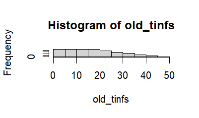

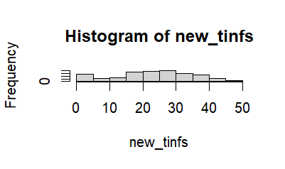

Important note: Currently, incidence of *cases* is used as the hazard rate for tinf. What we actually want is incidence of *infection.*

# 27 Feb 2026 (LH)

Time to infection (tinf in sim_stoch()) currently uses incidence of *cases* as the hazard rate. We could instead use this hazard rate to calculate tsymp, and then backcalculate tinf values. This is tricky for tsymp \> 100 - I instead tried drawing a rexp(1, 0.0025) if the tsymp \> 100. This is a little better, gives a longer tail, but we still end up with negative tinf values. See plots here of 1000 draws of progressor_type and tsymp, with tinf then backcalculated:

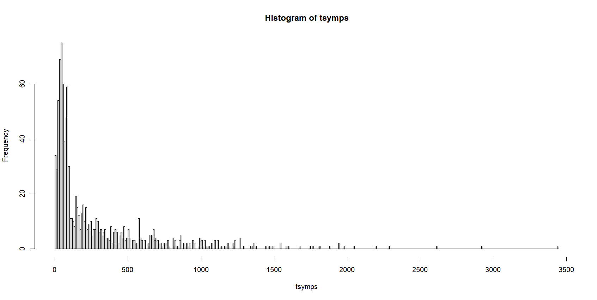

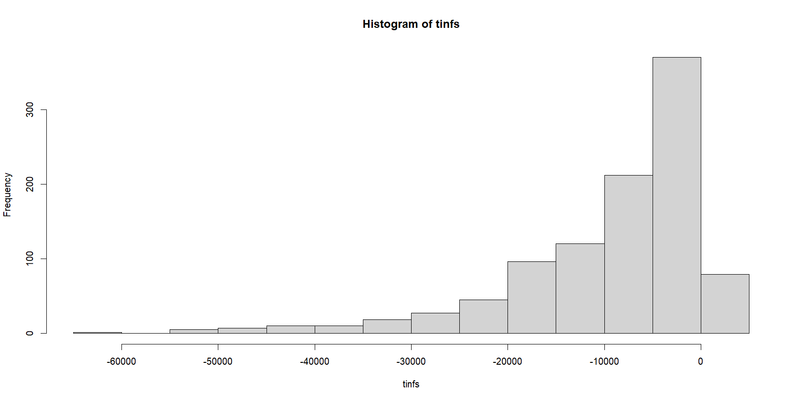

Most tinfs are negative with this method.... Need to find another workaround. Have made a GitHub Issue. In the meantime, I will undo the above changes.

Today I also sped up the code significantly, and added parallelisation so it can be run on multiple cores (`workers=n`).

# 3rd March 2026 (LH)

Summary and further exploration of age structure methods. How have the changes affected model outputs?

+-------------+----------------------------------+----------------------------------------------------------------------------------+--------------------------------------------------+--------------------------------------------------------------------------------------------------------------------------------------------------------------------------------------------------------------------------------------------------+-----------------------------------------------------+
| Scenario \# | Population agedist method        | tinf method/ values                                                              | Probability of fast progression by age           | Comments on model outputs                                                                                                                                                                                                                        | Figure file names (in `"/figures/"`)                |
+=============+==================================+==================================================================================+==================================================+==================================================================================================================================================================================================================================================+=====================================================+
| 1           | uniform Stephen                  | uniform Stephen (note: this is uniform *case* incidence)                         | uniform Stephen                                  | Initial setup. Note that this used case incidence rather than infection incidence by mistake. Overall/screened 14,000/ 10,000 in m72 case and \~700,000 in lit case. Recruited (blue) is approx 4,000 in m72 case and approx 70,000 in lit case. | stochastic_analytic_lit; stochastic_analytic_m72IIb |
|             |                                  |                                                                                  |                                                  |                                                                                                                                                                                                                                                  |                                                     |
|             |                                  |                                                                                  |                                                  |                                                                                                                                                                                                                                                  | And ...\_unif \_unif \_unif                         |
+-------------+----------------------------------+----------------------------------------------------------------------------------+--------------------------------------------------+--------------------------------------------------------------------------------------------------------------------------------------------------------------------------------------------------------------------------------------------------+-----------------------------------------------------+
| 2           | by_age country e.g. South Africa | uniform Stephen (note: this is uniform *case* incidence)                         | uniform Stephen                                  | Overall/ screened 14,000 / 10,000 in m72 case and \~700,000 in lit case. For lit case, plots are same as #1 (probably because the incidence is v low). For m72 case, v similar but v slightly fewer overall/ screened.                           | ...\_ZAF \_unif \_unif                              |
+-------------+----------------------------------+----------------------------------------------------------------------------------+--------------------------------------------------+--------------------------------------------------------------------------------------------------------------------------------------------------------------------------------------------------------------------------------------------------+-----------------------------------------------------+
| 3           | by_age country South Africa      | using by_age case inc as a naive proxy for tinf hazard rate ("case-inc-naive")   | uniform Stephen                                  | M72 plot same as #2 (because inc_by_age is not actually used in pars_m72).                                                                                                                                                                       | ...\_ZAF \_naive \_unif                             |
|             |                                  |                                                                                  |                                                  |                                                                                                                                                                                                                                                  |                                                     |
|             |                                  |                                                                                  |                                                  | For lit plot, overall/ screened is now much lower, around \~400,000. And stochastic estimates slightly lower than analytic estimates.                                                                                                            |                                                     |
+-------------+----------------------------------+----------------------------------------------------------------------------------+--------------------------------------------------+--------------------------------------------------------------------------------------------------------------------------------------------------------------------------------------------------------------------------------------------------+-----------------------------------------------------+
| 4           | by_age country South Africa      | using by_age case inc with a lag (for tinf hazard rate)                          | uniform Stephen                                  | DISCUSSED AND AGREED THE LAG METHOD IS NOT NEEDED.                                                                                                                                                                                               | N/A                                                 |
+-------------+----------------------------------+----------------------------------------------------------------------------------+--------------------------------------------------+--------------------------------------------------------------------------------------------------------------------------------------------------------------------------------------------------------------------------------------------------+-----------------------------------------------------+
| 5           | by_age country South Africa      | ARTI uniform (e.g. 4%)                                                           | uniform Stephen                                  | Used rho = 0.04.                                                                                                                                                                                                                                 | ... \_ZAF \_ARTI \_unif                             |
|             |                                  |                                                                                  |                                                  |                                                                                                                                                                                                                                                  |                                                     |
|             |                                  |                                                                                  |                                                  | Lit plot: Recruited (blue) is slightly higher - \~85,000 max. Overall/ screened is way lower, around 125,000.                                                                                                                                    |                                                     |
+-------------+----------------------------------+----------------------------------------------------------------------------------+--------------------------------------------------+--------------------------------------------------------------------------------------------------------------------------------------------------------------------------------------------------------------------------------------------------+-----------------------------------------------------+
| 6           | by_age country South Africa      | ARTI_by_age data if it exists OR calculate ARTI_by_age from infection prevalence | uniform Stephen                                  | Used rho = South Africa ARTI by age estimates (high values) from Wood 2010.                                                                                                                                                                      | ... \_ZAF \_ZAF \_unif                              |
|             |                                  |                                                                                  |                                                  |                                                                                                                                                                                                                                                  |                                                     |
|             |                                  |                                                                                  |                                                  | Lit plot: very similar to 5. Very slight increased slope in recruited but minimal difference.                                                                                                                                                    |                                                     |
+-------------+----------------------------------+----------------------------------------------------------------------------------+--------------------------------------------------+--------------------------------------------------------------------------------------------------------------------------------------------------------------------------------------------------------------------------------------------------+-----------------------------------------------------+
| 7           | by_age country South Africa      | best method from 1-6 - ARTI by age (method 6)                                    | source Vynnycky & Fine 1997 suggested by Kristin | Used rho = South Africa ARTI by age estimates (high values) from Wood 2010.                                                                                                                                                                      | ... \_ZAF \_ZAF \_Vynn                              |
|             |                                  |                                                                                  |                                                  |                                                                                                                                                                                                                                                  |                                                     |
|             |                                  |                                                                                  |                                                  | Lit plot: Recruited (blue) is \~30,000. Overall/screened is now much lower, around 50,000.                                                                                                                                                       |                                                     |
+-------------+----------------------------------+----------------------------------------------------------------------------------+--------------------------------------------------+--------------------------------------------------------------------------------------------------------------------------------------------------------------------------------------------------------------------------------------------------+-----------------------------------------------------+

Formally, $\rho$ should be the annual rate of Tuberculosis infection (ARTI) not case incidence. **So scenarios 1-4 are now obsolete and can be ignored.**

Age-varying ARTI can be calculated from *infection prevalence* estimates, using the following formula: $R = 1 –(1 –P)^{1/A}$, where R is the annual risk of infection (expressed as a fraction), P is M.tb. infection prevalence of the age group (expressed as a fraction), and A is the mean age of the participants. This method is defined in [Arnadottir et al., 1996](https://linkinghub.elsevier.com/retrieve/pii/S0962847996901276). Note that most national TB prevalence surveys are for *prevalence of disease* not *prevalence of infection* so are not what we want for P.

Key takeaways from adding age structure and other model developments (12th March 2026):

- Adding population age distribution made small but not significant overall effects e.g. in the South Africa example. Any UN country population can now be used, in addition to the original `uniform` pop.

- Correcting case incidence to be ARTI in calculation of tinf made significant differences to model outputs. Overall and screened now expected to be around \~125,000 in the lit case rather than the very high estimate of 700,000 before. More than 5x lower.

- Changing from uniform to age-varying ARTI in the South Africa Wood-2010 example made little effect on model outputs, but note the Wood data is similar (on average) to the uniform 4% that was used previously. There are now 7 different age-varying ARTI data sets that can be used (2 for South Africa, and 1 for each of The Gambia, Saudi Arabia, Vietnam, Tanzania, Greenland).

- Lastly, the probability of being a fast progressor now also changes with age. Vynnycky-1997 estimates a probability of 4% for ages 0-10, 9% for age 15, and 14% for ages 20+ (with straight line interpolation between ages 10 and 20) - Table 3. This is higher overall than the uniform 5% assumed previously. This did affect model outputs significantly, reducing number recruited to one third of its original value (30,000 cf. 80,000) and number screened and overall to less than half their original values (\~50,000 cf. 125,000). Note that we should consider whether we want to use these Vynnycky estimates – estimates come from modelling published in 1997 but it is widely cited in present day.

# 6th March 2026 (LH)

Added short few lines of code to estimate the case incidence from each simulation (sigma=80 and rep=1 by default).

# 10th March 2026 (LH)

**Calculation of tinf using age-varying ARTI as the hazard rate:**

This now works properly - yay! Note that only the stochastic method has age-varying risk of infection. Adding age-varying hazard to the analytic method would require recalculation of the probability expressions - currently it is still uniform exponential, with rate naively grabbed from rho[age].

**Fast progressors to disease:**

This is about adding age-varying probability of being a fast progressor. This changes p_slow (but not mu_slow or mu_fast). Again, we leave the analytic method as is (constant rates), so as not to get into much horrid probability expressions and algebra. For the stochastic method, we use values from Vynnycky & Fine 1997.

I have not included any variation in mu_slow or mu_fast by age, but there is some evidence to support this. E.g. for slow progressors (infected more than 2 years ago), Menzies et al. reports that "Rates of progression to TB were higher in younger age groups, estimated to be 5.7 (4.5, 7.0) per 1000 person–years for 0–14 year olds and 1.5 (1.3, 1.7) per 1000 person–years for 15–24 year olds." But I guess we at least partially capture this in the exponential pmf anyway.

Menzies et al LID 2018 (a review of how progression is modelled in TB models) identifies \~10 different compartmental model structures that are in use. Structure B has a different progression risk for each time step since infection, but I can't see that any model parameters vary by *age* (rather than time)?

# 12th-16th March 2026 (LH)

Results 1: What values of age-varying ARTI give a plausible case incidence e.g. 100-250 cases per 100,000 per year?

Assume a South Africa-like population age distribution and by-age ARTI. We can use high or low ARTI study estimates (Wood-2010 or Ncayiyana-2016 respectively). And we can use uniform 5% or Vynncyky (4-14%) probability of being a fast progressor. Let's create a table for these 4 key data options:

+--------------------------+--------------------+-------------------------------------------------------------------------------------------------------------------------------------------------+----------------------------------------------------------------------------+
| South Africa ARTI by age | Prob of being fast | pars_lit                                                                                                                                        | Estimated median (range) case incidence from 100 simulations with sigma=80 |
+==========================+====================+=================================================================================================================================================+============================================================================+
| High (\~3-5.5%)          | Uniform 5%         | `pars_lit_igra <- list( minage=18, maxage=49, rho=rho_lit, p_slow=p_slow_lit, mu_slow=0.0001, mu_fast=1.5, sigma=100, ve=0.55, trial_length=3)` | 21 (16-29) cases per 100k per year                                         |
+--------------------------+--------------------+-------------------------------------------------------------------------------------------------------------------------------------------------+----------------------------------------------------------------------------+
| High (\~3-5.5%)          | Vynnycky (4-14%)   | as above                                                                                                                                        | 45 (31-59) cases per 100k per year                                         |
+--------------------------+--------------------+-------------------------------------------------------------------------------------------------------------------------------------------------+----------------------------------------------------------------------------+
| Low (\<3%)               | Uniform 5%         | as above                                                                                                                                        | 12 (10-17) cases per 100k per year                                         |
+--------------------------+--------------------+-------------------------------------------------------------------------------------------------------------------------------------------------+----------------------------------------------------------------------------+
| Low (\<3%)               | Vynnycky (4-14%)   | as above                                                                                                                                        | 26 (21-38) cases per 100k per year                                         |
+--------------------------+--------------------+-------------------------------------------------------------------------------------------------------------------------------------------------+----------------------------------------------------------------------------+

We are an order of magnitude off. Try ARTI = uniform 6%:

+-------------+------------------+-------------+------------------------------------+
|             |                  |             |                                    |
+=============+==================+=============+====================================+
| Uniform 6%  | Vynnycky (4-14%) | as above    | 39 (31-53) cases per 100k per year |
+-------------+------------------+-------------+------------------------------------+
| Uniform 4%  | Vynnycky (4-14%) | as above    | 43 (32-55) cases per 100k per year |
+-------------+------------------+-------------+------------------------------------+
| Uniform 10% | Vynnycky (4-14%) | as above    | 26 (23-33) cases per 100k per year |
+-------------+------------------+-------------+------------------------------------+

Uniform ARTI seems to not be acting in the way I expect. Let's explore the survival functions for these scenarios, to understand what is going on under the hood:

A higher annual rate of infection means higher chance of contracting the infection each year and hence more likely for first infection to be in younger ages. Hence infections are concentrated into the \<20y population and the survival_fn for larger ARTI has a steeper drop (first: ARTI=4%, second: ARTI=10%):

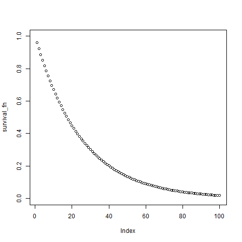{width="251"}

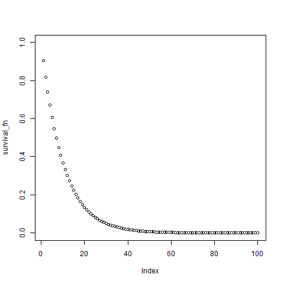{width="251"}

How does this affect the survival_pmf? Plots are as follows (first: ARTI=4%, second: ARTI=10%):

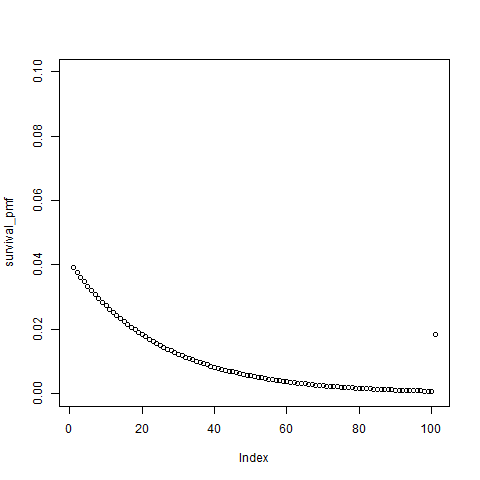{width="251"}

{width="251"}

We see the probability of being infected in first \~20years of life is much greater with ARTI=10%. Here the vast majority of infections happen in the first \~10 years of life. Translating to our model, most tinf values will be $\leq$ 10 and a fair number would have developed disease already before enrolment (`n_overall - n_recruited`). There are also fewer 'recent' infections (more slow progressors). Both of these lead to a larger denominator `n_overall` and lower estimated case incidence.

Great - now we understand what is going on in the model, we should ask if this is realistic? Something to think about.

# 16th March 2026 (LH)

We are still working on the following:

"Results 1: What values of age-varying ARTI give a plausible case incidence e.g. 100-250 cases per 100,000 per year?"

Currently our age-varying ARTI for South Africa (Wood et al) is as follows (first=ARTI, second=survival_fn, third=survival_pmf):

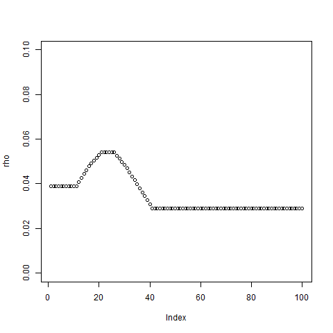{width="175"}

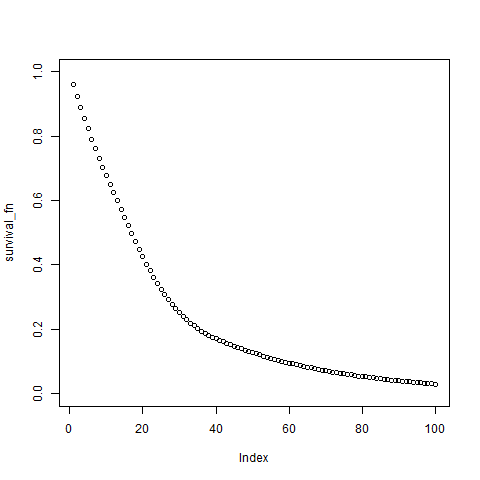{width="175"}

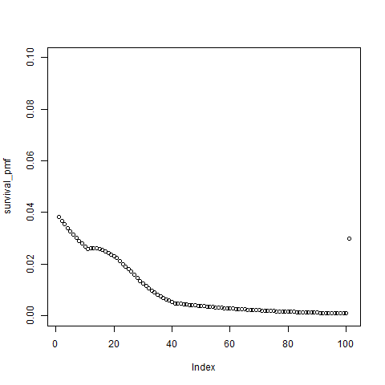{width="175"}

Using the intuition from the above notes (12th-16th March), I imagine we want to concentrate our infections in the ages of the trial population, to increase % of individuals who are recently infected, thus increasing % who are fast.

- What happens if we just double the SA ARTI curve throughout (e.g. rho\<-rho\*2)? Again this concentrates infections in the young which is not what we want.

- Consider increasing ARTI *only* in ages \~20-40 (around the eligible age range for the trial). Set `ARTI[20:40] <- ARTI[20:40]*5`. Call this 'stretched peak'. Better - case incidence is now \~68 cases per 100k per year. Still not the range we are looking for though.

After discussing with Stephen (20th March), we conclude the following:

- Conclusion : we think that ARTI is not what we want for rho.
  - As defined, we now think rho should be **force of infection.** 

    - We are simulating infection to a steady state with hazard of infection rho (exponentially distributed). Low hazard rate - things happen late. High hazard rate - things happen early.

    - rho is a rate, so its not quite ARTI (which is a risk). Stephen thinks that for the physical processes we are representing here, rho should be force of infection.

  - Now the preliminary results question is: What values of age-varying foi rho give plausible ARTI? (Calculating ARTI outside of the model like I am for cases).

    - Investigate this numerically. E.g. maybe four values foi at age 0, 20, 40, 80. See what ARTI the model produces (and subsequently what cases the model produces).

    - We think foi should grow massively with age (because very few susceptibles left in adulthood).

    - Nb: ignore Wood et al 2010 foi estimates - their definition of foi does not align with our interpretation.

# 27th-30th March 2026 (LH)

Changed ARTI -\> foi in code. Wrote a quick function to estimate infection prevalence and ARTI from model. Ran a few simulations for different foi's:

+---------------+-----------------------+-----------+------------+------------+-----------------------+-----------+----------+
| foi_structure | infection_prevalence1 | ARTI1     | cases_min1 | cases_max1 | infection_prevalence2 | ARTI2     | cases2   |
+:==============+======================:+==========:+===========:+===========:+======================:+==========:+=========:+
| uniform4      | 0.7114811             | 0.0364244 | 30.79454   | 58.86564   | 0.7108885             | 0.0363654 | 42.65139 |
+---------------+-----------------------+-----------+------------+------------+-----------------------+-----------+----------+
| uniform6      | 0.8377743             | 0.0528441 | 32.31318   | 52.57591   | 0.8378896             | 0.0528642 | 38.27642 |
+---------------+-----------------------+-----------+------------+------------+-----------------------+-----------+----------+
| 5,8,8,8       | 0.8311868             | 0.0517180 | 37.85567   | 60.65643   | NA                    | NA        | NA       |
+---------------+-----------------------+-----------+------------+------------+-----------------------+-----------+----------+
| 5,10,20,30    | 0.8548957             | 0.0559923 | 43.26882   | 73.00132   | NA                    | NA        | NA       |
+---------------+-----------------------+-----------+------------+------------+-----------------------+-----------+----------+
| 5,20,40,50    | 0.9082453             | 0.0688199 | 43.45901   | 69.75439   | NA                    | NA        | NA       |
+---------------+-----------------------+-----------+------------+------------+-----------------------+-----------+----------+
| 5,25,50,70    | 0.9196090             | 0.0724878 | 41.67618   | 66.20451   | NA                    | NA        | NA       |
+---------------+-----------------------+-----------+------------+------------+-----------------------+-----------+----------+

1=stochastic approach (median from 25 repetitions); 2=analytic approach. Note the analytic has no age structure and is meaningless when run with non-uniform foi.

25 repetitions isn't very many so I ran again for 100 repetitions. Here the new summary table (using `knitr::kable(summary_table)` to print the table in a nice markdown format):

+---------------+-----------------------+-----------+------------+------------+-----------------------+-----------+----------+
| foi_structure | infection_prevalence1 | ARTI1     | cases_min1 | cases_max1 | infection_prevalence2 | ARTI2     | cases2   |
+:==============+======================:+==========:+===========:+===========:+======================:+==========:+=========:+
| uniform4      | 0.7103147             | 0.0363083 | 32.31737   | 62.48219   | 0.7108885             | 0.0363654 | 42.65139 |
+---------------+-----------------------+-----------+------------+------------+-----------------------+-----------+----------+
| uniform6      | 0.8378392             | 0.0528554 | 29.58173   | 56.92928   | 0.8378896             | 0.0528642 | 38.27642 |
+---------------+-----------------------+-----------+------------+------------+-----------------------+-----------+----------+
| 5,8,8,8       | 0.8314365             | 0.0517599 | 35.75042   | 65.75450   | NA                    | NA        | NA       |
+---------------+-----------------------+-----------+------------+------------+-----------------------+-----------+----------+
| 5,10,20,30    | 0.8551929             | 0.0560501 | 34.43678   | 67.94885   | NA                    | NA        | NA       |
+---------------+-----------------------+-----------+------------+------------+-----------------------+-----------+----------+
| 5,20,40,50    | 0.9081022             | 0.0687766 | 39.37186   | 79.66431   | NA                    | NA        | NA       |
+---------------+-----------------------+-----------+------------+------------+-----------------------+-----------+----------+
| 5,25,50,70    | 0.9202141             | 0.0726970 | 43.03942   | 69.38878   | NA                    | NA        | NA       |
+---------------+-----------------------+-----------+------------+------------+-----------------------+-----------+----------+

Thoughts:

- Infection prevalence for eligible ages (18-49y) in these simulations ranges from 71% to 92%. We would expect most or nearly all? adults in South Africa to be infected, so this seems plausible.
- ARTI is perhaps a bit low when using uniform 4% force of infection. (We also do not expect force of infection to be at all uniform).
- The non-uniform force of infection scenarios ("5,a,b,c") use 5% for ages 0-19, then a% for ages 20-39, b% for ages 40-79, and c% for ages 80+. The final scenario gives an average ARTI which is a bit too large.
- The foi values for age \> 49 years are probably not being used at all - since these individuals are not in the eligible age range of the trial.
- Middle scenarios seem somewhat ok but we still aren't getting anywhere near the case numbers we would expect.

# 1st April (LH)

Claude-assisted diagnostics were run on the whole codebase. Some free-flowing observations of mine are listed below:

**Diagnostic 1: foi inputs and infection timing**

- Plots of survival fn and survival pmf. Survival pmf gives the probability that an individual is infected during year a (by definition). This is equivalent to plotting 'age distribution of first infection'. My current foi functions give a huge peak in early 20s due to the step up in foi at age 20.

- Table 1c. Where in the life-course do infections land? Currently with just 5% foi for ages 0-19, this is creating a huge amount of infections in individuals younger than the trial ages (59%). Perhaps I want to reduce this. From a mean age of infection plot that I saw in the literature last week, approx 50% of infections occur by age \~45 in AFRO region – currently my model has a mean age of infection of less than 18!

  - Check the mean age of infection literature:

    - Houben and Dodd 2016 (<https://doi.org/10.1371/journal.pmed.1002152>). Two modellers from LSHTM TB modelling group.

    - Fig 3 shows estimated infection prevalence by age (whole regions). 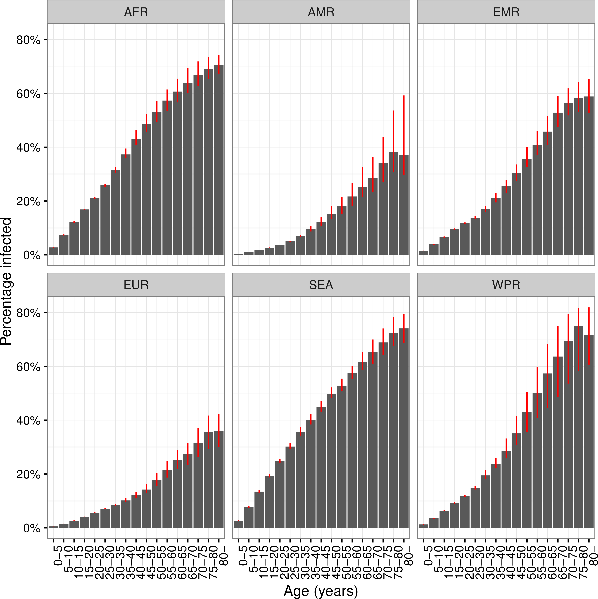{width="343"}

    - In AFRO region, this plot suggests approx 15% infected by age 20, approx 35% infected by age 40, approx 65% infected by age 80, and approx 70% thereafter. (Although note this includes some recovery so later ages likely a bit low). I should try to get my foi to produce similar survival_pmf values to this or other literature [TASK 1].

    - Note that other studies for South Africa give a slightly different picture. Wood Table 2/Figure 3 (Latent TBI) estimates 67% at age 20, 77% at age 30, and 69% at age 40 in a crowded township. Ncayiyana Table 2 has infection prevalence of approx 26% at age 20, 31% at age 30, 45% at age 40, and 45% for ages 45y+, again for a crowded township. Wood has ARTI estimates of 4-5% while Ncayiyana is much lower at 1-3%.

- A high '% infected before 18y' means most people entering the trial window already have infections and are nearly all slow progressors. Hence `n_fast/n_overall` will be tiny and case incidence estimates will be low.

Diagnostic table 1c for our model is as follows: Where in the life-course do infections land?

+--------------+-------------------+--------------------+------------------+-------------------+
| FOI scenario | \% infected \<18y | \% infected 18–49y | \% infected 50+y | \% never infected |
+:=============+==================:+===================:+=================:+==================:+
| uniform4     | 51.3              | 35.1               | 11.7             | 1.8               |
+--------------+-------------------+--------------------+------------------+-------------------+
| uniform6     | 66.0              | 29.0               | 4.7              | 0.2               |
+--------------+-------------------+--------------------+------------------+-------------------+
| uniform10    | 83.5              | 15.9               | 0.7              | 0.0               |
+--------------+-------------------+--------------------+------------------+-------------------+
| 5-8-8-8      | 59.3              | 37.3               | 3.3              | 0.1               |
+--------------+-------------------+--------------------+------------------+-------------------+
| 5-10-20-30   | 59.3              | 40.0               | 0.7              | 0.0               |
+--------------+-------------------+--------------------+------------------+-------------------+
| 5-20-40-50   | 59.3              | 40.6               | 0.0              | 0.0               |
+--------------+-------------------+--------------------+------------------+-------------------+
| 5-25-50-70   | 59.3              | 40.7               | 0.0              | 0.0               |
+--------------+-------------------+--------------------+------------------+-------------------+
| 3-3-5-10     | 41.7              | 40.0               | 17.7             | 0.6               |
+--------------+-------------------+--------------------+------------------+-------------------+
| 1-5-10-15    | 16.5              | 72.4               | 11.1             | 0.0               |
+--------------+-------------------+--------------------+------------------+-------------------+

**Diagnostic 2: Population composition at trial entry**

Nothing to add here – plots just confirm a high level of infecteds (in both analytic and stochastic approaches).

**Diagnostic 3: Stepwise age-structure effects**

Here we are running the code adding in more age structure each time (but note the 'uniform' will not be identical to Stephen's original code). Nothing to note here.

**Diagnostic 4: Case incidence decomposition - fast vs slow contribution**

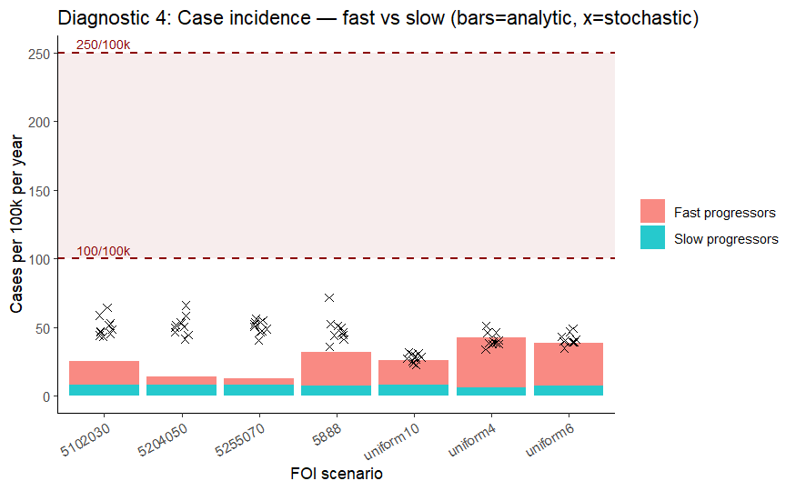

**Diagnostic 5: Senstivity to mu-slow**

mu_slow is currently 0.0001. We would need mu_slow to be at least 0.001 i.e 10 times larger (all else being equal) to reach our target case incidence of \~100 cases per 100k per year.

Let's recheck what mu_slow should be from the literature:

- Rechecking Stephen's notes on parameter values from the literature (27jul), it looks as if we assume an annual rate of 0.0001 of progressing to active disease, and Menzies 2018 states that "for individuals with long-established infection, the annual risk of active tb is low; empirical estimates are on the order of 10-20 per 100k individuals.3"

  - Note that ref 3 is for a paper on Saskatchewan from 1971 (Barnett) and not publicly available.

  - Do we have a slight mismatch between risks and rates again here? And does 10-20 per 100k seem to be supported anywhere else in the literature (I can't find many papers that publish a rate of progression to disease for slow progressors). If any other empirical estimates available, try running the model with these. [TASK 2]

    - Shea 2014 estimates 0.00084 per year in the US (<https://doi.org/10.1093/aje/kwt246>).

    - Many studies Hayley, Sutherland etc state a lifetime risk (NB: this is fast+slow) of developing disease of approx 10% (<http://dx.doi.org/10.1128/microbiolspec.TNMI7-0039-2016>). Refs 8,13,21-23. Several other studies use this same guiding assumption.

    - Ekramnia 2024 estimates 0.00072 per years in the US (<https://pubmed.ncbi.nlm.nih.gov/38290139/>).

    - From Menzies Supplementary table s3, some model structures publish their fitted parameter value c (Sutherland 1968): 0.000848, 0.000594, structure K 0.001 at year 5 tending to 0.0001 at year \~15 and 0.00001 by year 40, structure L 0.0009 at year 5 but tending to 0.00056 from year \~9 onwards ([https://doi.org/10.1016/S1473-3099(18)30134-8](https://doi.org/10.1016/S1473-3099(18)30134-8){.uri}). This list excludes structures A, D, J, and E, which had poor fit to empirical data. Our model is most similar to structure F.

    - Could also check Vynnycky&Fine 1997, Blower 1995, and Dye 1998. Useful term is 'endogenous reactivation' (of the latent infection).

    - Blower 1995 uses a progression rate to TB for latent individuals of 0.00256-0.00527 (<https://www.nature.com/articles/nm0895-815.pdf>).

    - Vynnycky&Fine 1997 - from a closer look, this modelling paper estimates both p_fast by age (already included in my model) and risk of developing endogenous disease by age (i.e. mu_slow). Their best estimates are annual risk of developing slow disease of 9.82e-8 [9.03e-9 - 1.52e-3] for ages 0-10years, 0.0150 [0.0144-0.0159] for age 15, and 0.0299 [0.0288-0.0307] for ages 20+. Ages are *current age*, not age of infection. Endogenous disease is defined as disease onset five or more years after initial infection or the most recent reinfection. Note these estimates are way higher than our current mu_slow. After lots of reading, I think this is the best study to go with.

    - Sutherland 1982 estimates annual risk of disease for individuals infected more than 5 years ago as 0.023% per year i.e. 0.00023 ([https://doi.org/10.1016/S0041-3879(82)80013-5](https://doi.org/10.1016/S0041-3879(82)80013-5){.uri}).

    - Dowdy (wishlist paper) 2014 states that estimations of the reactivation rate after remote infection vary by an order of magnitude, from 0.03 to 0.1 per 100 person-years. i.e. from 0.0003 to 0.001 per year (<https://pmc.ncbi.nlm.nih.gov/articles/PMC4041555/pdf/nihms584157.pdf>).

    - Horsburgh 2010 population skin-test survey in US estimated rate of reactivation among persons with LTBI as 0.0004 - 0.00058 per year (<https://pmc.ncbi.nlm.nih.gov/articles/PMC2921602/pdf/AJRCCM1823420.pdf>).

    - Let's summarise in a table:

      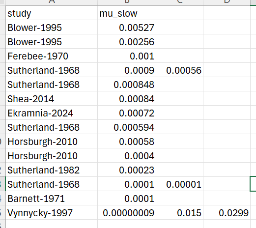

      We will use mu_slow=0.001 as the baseline and the range shown and also age-varying Vynnycky as alternatives.

**Diagnostic 6: Time since infection for recruits**

Plot 6b is interesting, but perhaps more useful to look at cumulative prevalence by age from the model if we can?

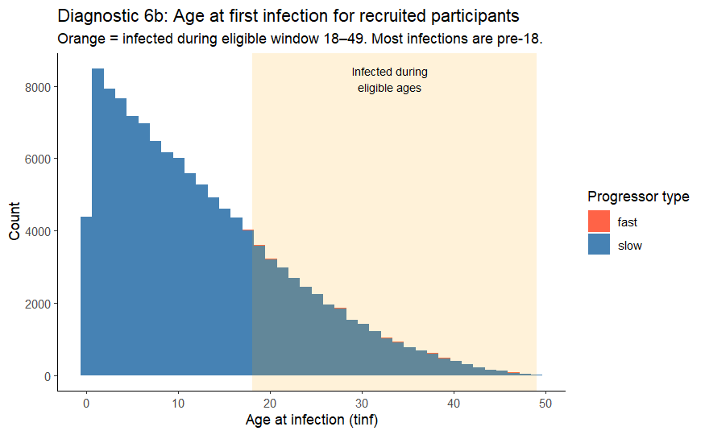

# 7th April (LH)

Based on yesterday's diagnostics, lets try to alter foi to match observed infection prevalence by age in South Africa Wood 2010 study [TASK 1], and to explore other mu_slow values from the literature [TASK 2].

**Task 1:** Try a set of piecewise-constant FOI scenarios (four age bands: 0–19y, 20–39y, 40–79y, 80y+) and compare the resulting infection prevalence by age and ARTI against three empirical benchmarks:

1.  **Ncayiyana 2016** (South Africa, Table 2): 26% at age 20, 31% at age 30, 45% at age 40, plateau thereafter 45% for ages 45+. This study samples crowded townships of Cape Town where HIV prevalence and TB notification is very high - only HIV-negatives sampled.
2.  **Wood 2010** (South Africa, Table 2/Figure 3): 67% at age 20, 77% at age 30, 69% at age 40. This is LTBI prevalence — unclear if fasts are included. On a quick check of the sample population, this study also focuses on a crowded township - an informal settlement with high crowding and one of the poorest in Johannesburg.
3.  **Houben & Dodd 2016** (AFRO region, Figure 3): \~15% at age 20, \~35% at age 40, \~65% at age 80, \~70% thereafter. Note that this is for the whole AFRO region, and also may include recovery.

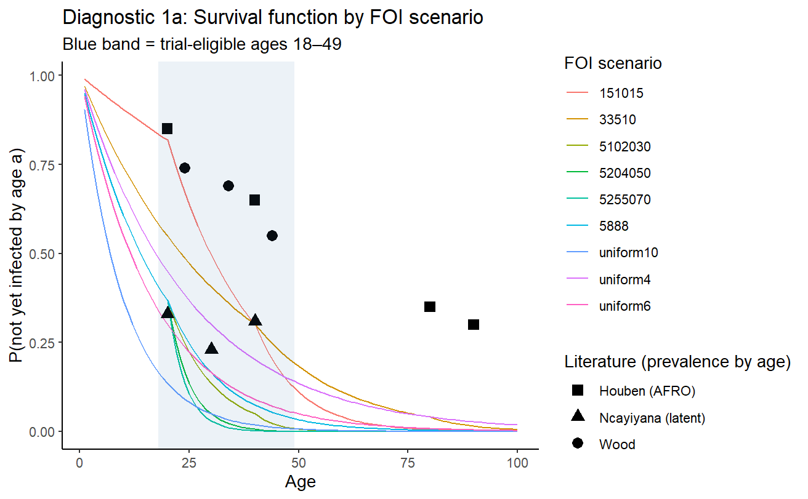

**Task 2:** Test four alternative `mu_slow` values from the literature: 0.0002/year (Saskatchewan 1971), 0.0004/year and 0.00084/year (Shea et al. 2014), and the value implying 10% lifetime TB risk (Haley et al.) e.g. approx 0.001/year, and Vynnycky&Fine's age-varying mu_slow.

# 9th April (LH)

Thinking further about plausible range for force of infection, pulling theory from Vynnycky&White textbook. Some thoughts:

For average foi, 5% per year is described as low and 25% per year as high (e.g. measles in Ethiopia early 2000s) (p107).

Using a simple catalytic model for time to infection (ever infected) as we do, the following plot shows proportion susceptible over time for different annual foi values. This is using $s(a) = e^{-\lambda a}$:

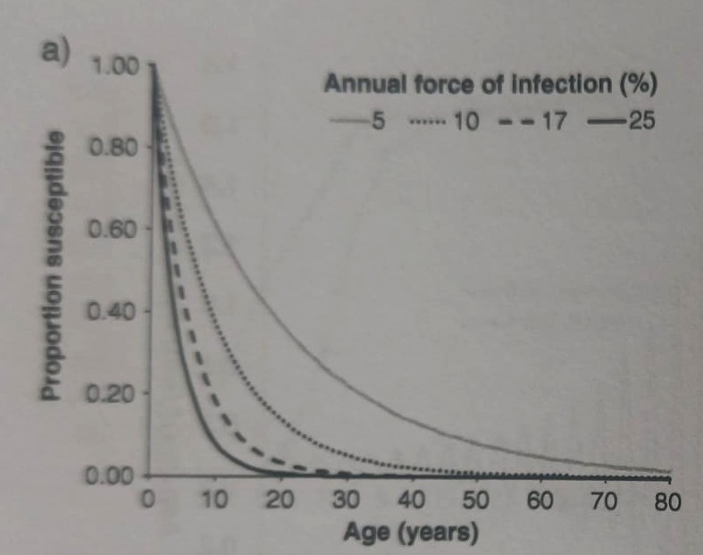

We can also investigate whether foi should be age-varying by looking at -ln(s(a)) plot. E.g. prevalence by age estimates from Wood are as follows:

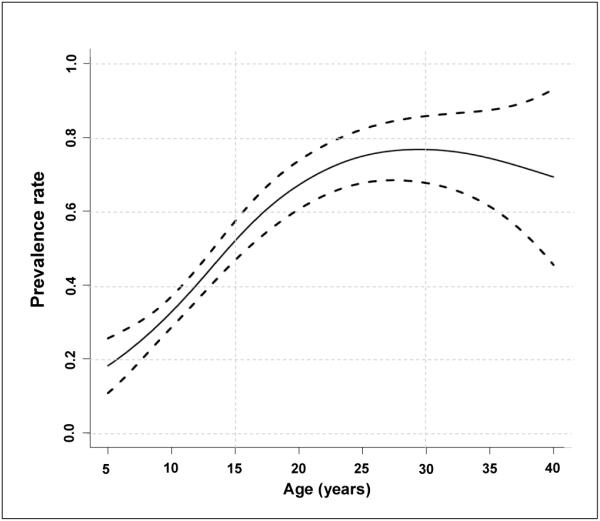

From a quick plot digitiser, the plot of -ln(s(a)) is as follows:

```{r}
plot_digitizer <- read.csv(file = "data/Wood-prevalence-plot-data_plotdigitizer.csv") %>% mutate(s_a = 1 - y)
plot_digitizer
plot(x=plot_digitizer$x, y=-log(plot_digitizer$s_a))
```

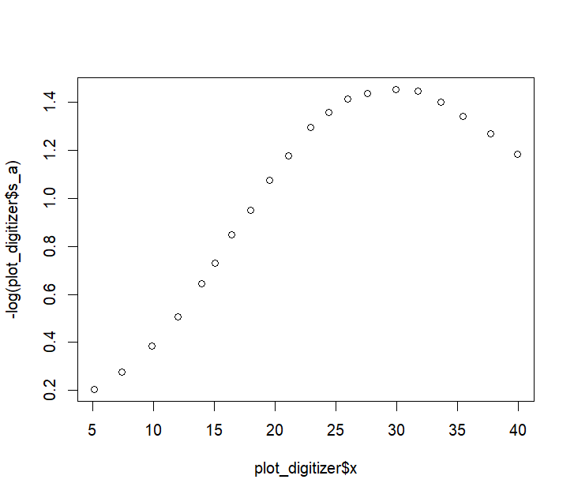

# 27th April (LH)

Ran many sims to explore different values of the foi (parameter_fit code snippet). Saved in `outputs/parameter_fit_results.csv`. Interesting results. Appended a column at the end to highlight which parameter combinations meet all our conditions i.e. infection prevalence at age 20, 30, and 40 matching close to Wood et al (technically our model has 'ever infected' not 'infection prevalence'), and ARTI close to Wood et al, and cases \> 200 per 100k per year.

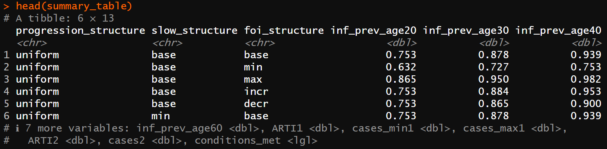

We have \~6 sets of parameter combinations that satisfy all our criteria. Key results pasted to manuscript supplementary to discuss with co-authors.

# 28th April (LH)

Now thinking about the trial emulated model run.
